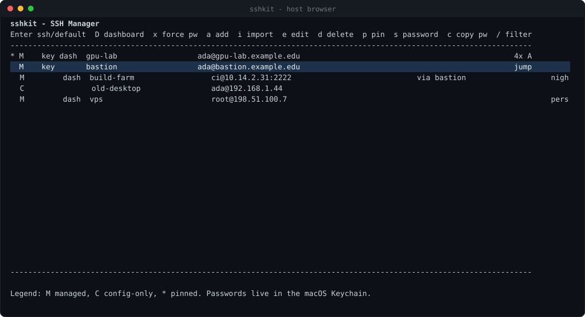
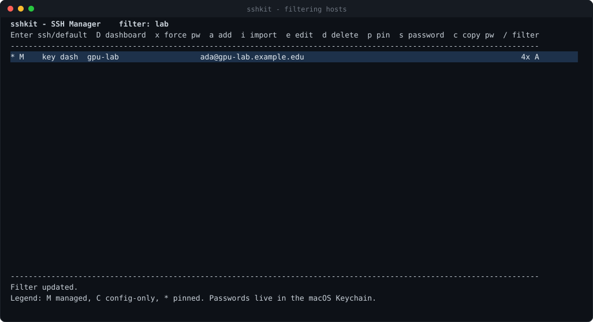
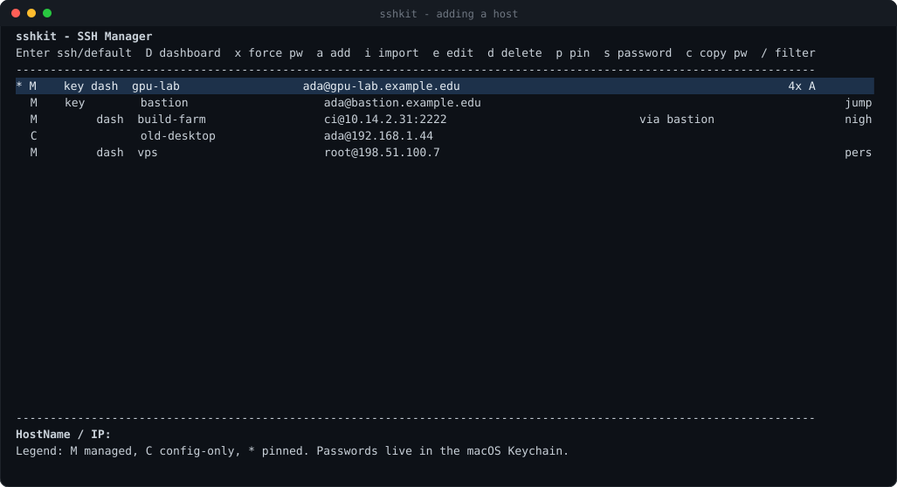
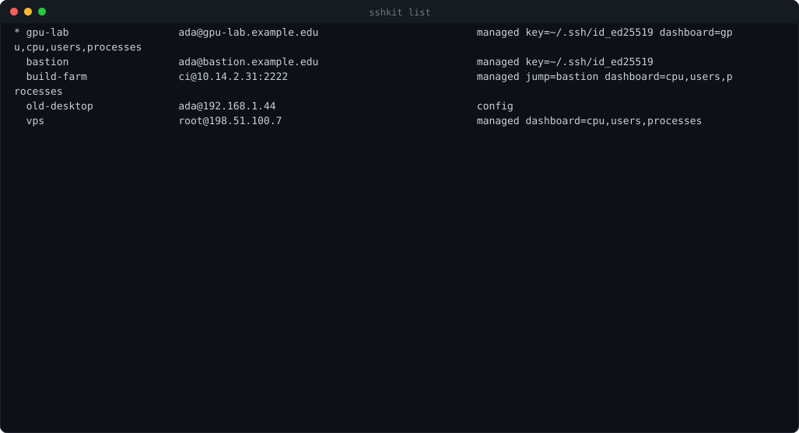
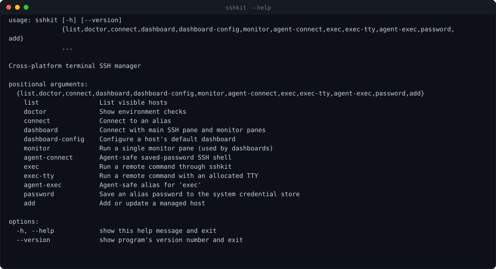
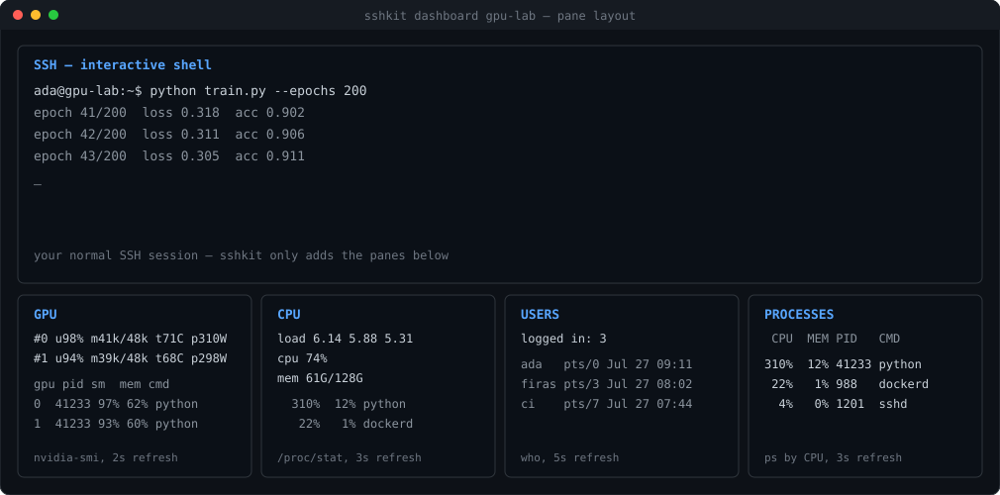

<div align="center">

# sshkit

**A terminal SSH manager that stays out of your way.**

Browse your hosts, connect with one key, keep passwords in the OS keystore,
and watch GPU/CPU/users/processes in split panes while you work.

Runs on **macOS**, **Linux** and **Windows**.

[](https://github.com/alpaslan-exe/sshkit/actions/workflows/ci.yml)
[](https://github.com/alpaslan-exe/sshkit/releases/latest)
[](LICENSE)
[](pyproject.toml)



</div>

---

## Why

`~/.ssh/config` is fine until you have twenty hosts, three jump boxes and a GPU
server whose load you need to check before you launch anything. sshkit is a
single small program that:

- lists every host you already have — it **reads your existing `~/.ssh/config`**, it does not replace it
- writes its own hosts into a clearly marked block of that same file, so plain `ssh <alias>` keeps working everywhere
- stores passwords in the **operating system's credential store**, never in a file
- types the saved password for you at the SSH prompt
- can split the terminal into a shell plus live remote monitors

Everything is one binary. No daemon, no config format to learn, no agent.

## Features

| | |
| --- | --- |
| **Host browser** | Curses list of managed *and* config-only hosts, with filter, pins and notes |
| **One-key connect** | `Enter` to connect, `D` for the dashboard, `x` to force saved-password autofill |
| **Password autofill** | Passwords live in Keychain / Credential Manager / Secret Service and are typed at the prompt through a real pty |
| **Split-pane dashboard** | Your SSH shell on top, `gpu` / `cpu` / `users` / `processes` panes below, refreshing live |
| **Mosh when available** | Interactive connects use [mosh](https://mosh.org) automatically if it's installed — roaming and lag-free typing; `--no-mosh` opts out, remote commands always use ssh |
| **Config-safe** | Your hand-written `~/.ssh/config` entries are preserved verbatim, outside sshkit's managed block |
| **Scriptable** | `sshkit exec`, `sshkit exec-tty` and `agent-*` variants for automation |
| **Cross-platform** | The same commands on macOS, Linux, WSL and Windows |

## Screenshots

<table>
<tr>
<td width="50%"><br><em>Filter across alias, host, user, jump host and notes.</em></td>
<td width="50%"><br><em>Adding a host writes both the state file and the ssh config block.</em></td>
</tr>
<tr>
<td><br><em><code>sshkit list</code> for scripts and quick greps.</em></td>
<td><br><em>Every action is available from the command line too.</em></td>
</tr>
</table>

### Dashboard

`sshkit dashboard gpu-lab` gives you the shell plus one pane per monitor,
driven by tmux (macOS/Linux/WSL) or Windows Terminal:



<sub>Pane layout diagram — the monitor panes stream real `nvidia-smi`, `/proc`, `who` and `ps` output from the remote host.</sub>

## Install

### Download a binary (no Python needed)

Grab the archive for your platform from the
[latest release](https://github.com/alpaslan-exe/sshkit/releases/latest).

```bash
# macOS (Apple silicon)
curl -LO https://github.com/alpaslan-exe/sshkit/releases/latest/download/sshkit-macos-arm64.tar.gz
tar xzf sshkit-macos-arm64.tar.gz
xattr -d com.apple.quarantine sshkit      # unsigned binary
install -m 755 sshkit ~/.local/bin/sshkit

# Linux
curl -LO https://github.com/alpaslan-exe/sshkit/releases/latest/download/sshkit-linux-x86_64.tar.gz
tar xzf sshkit-linux-x86_64.tar.gz
install -m 755 sshkit ~/.local/bin/sshkit
```

```powershell
# Windows (PowerShell)
Invoke-WebRequest -Uri https://github.com/alpaslan-exe/sshkit/releases/latest/download/sshkit-windows-x86_64.zip -OutFile sshkit.zip
Expand-Archive sshkit.zip -DestinationPath $env:LOCALAPPDATA\sshkit
# add $env:LOCALAPPDATA\sshkit to your PATH
```

### From source

```bash
git clone https://github.com/alpaslan-exe/sshkit
cd sshkit
pip install .          # adds the `sshkit` command
```

On Linux, install `keyring` (`pip install "sshkit-tui[keyring]"`) or `libsecret`
(`apt install libsecret-tools`) if you want saved passwords.

## Usage

```bash
sshkit                             # interactive host browser
sshkit list                        # every host sshkit can see
sshkit add gpu-lab gpu-lab.edu -u ada -k ~/.ssh/id_ed25519
sshkit password gpu-lab            # store the password in the OS keystore
sshkit connect gpu-lab             # connect (autofills the password if saved)
sshkit connect gpu-lab --mosh      # require mosh; --no-mosh forces plain ssh
sshkit dashboard gpu-lab           # shell + monitor panes
sshkit dashboard-config gpu-lab --on --gpu --no-users
sshkit exec gpu-lab -- nvidia-smi  # run one command and exit
sshkit doctor                      # what sshkit found on this machine
```

### Keys in the browser

| Key | Action | Key | Action |
| --- | --- | --- | --- |
| `↑` `↓` / `k` `j` | move | `a` | add host |
| `Enter` | connect | `e` | edit host |
| `D` | connect with dashboard | `d` | delete host |
| `x` | force saved-password autofill | `i` | import a config-only host |
| `s` | save password | `p` | pin to the top |
| `c` | copy password to clipboard | `/` | filter |
| `r` | reload | `q` | quit |

### `sshkit doctor`

```
sshkit version: 1.1.0
platform: macos
python: 3.12.7 (frozen binary)
state file: ~/.ssh/sshkit/hosts.json
ssh config: ~/.ssh/config
ssh client: /usr/bin/ssh
mosh client: /opt/homebrew/bin/mosh
credential store: macOS Keychain via macos-keychain
clipboard: /usr/bin/pbcopy
dashboard backend: tmux
password autofill: built-in pty wrapper
managed hosts: 5
all visible hosts: 6
```

## Platform support

| | macOS | Linux / WSL | Windows |
| --- | --- | --- | --- |
| Host browser + CLI | ✅ | ✅ | ✅ (`windows-curses`, bundled in the binary) |
| Credential store | Keychain (`security`) | Secret Service (`secret-tool` or `keyring`) | Credential Manager (`keyring`) |
| Password autofill | pty | pty | ConPTY via `pywinpty` (bundled); clipboard-paste fallback |
| Dashboard | tmux | tmux | Windows Terminal (`wt`), or tmux inside WSL |
| Clipboard | `pbcopy` | `wl-copy` / `xclip` / `xsel` | `clip` / `Set-Clipboard` |

Windows needs the OpenSSH client (`Add-WindowsCapability -Online -Name OpenSSH.Client~~~~0.0.1.0`,
or it is already present on Windows 10 1809+). sshkit finds it on `PATH` or in
`System32\OpenSSH`.

## How your files are treated

- **`~/.ssh/sshkit/hosts.json`** — sshkit's own state (hosts, pins, monitor settings). `0600`, or an ACL locked to your user on Windows.
- **`~/.ssh/config`** — sshkit rewrites *only* the block between:

  ```
  # >>> sshkit managed hosts >>>
  ...
  # <<< sshkit managed hosts <<<
  ```

  Anything outside those markers is copied through untouched, and hosts defined
  there show up in the browser as `C` (config-only) entries you can import.
- **Passwords** — never written to disk by sshkit; they go to the platform
  keystore under the service name `sshkit:<alias>`.

Override the locations with `SSHKIT_SSH_DIR`, `SSHKIT_DATA_DIR` and
`SSHKIT_SSH_CONFIG` (used by the test suite and the screenshot tooling).

## Security notes

- Autofill drives a real pty: the password goes to `ssh`'s own prompt, it is
  never put on a command line or in an environment variable.
- `StrictHostKeyChecking accept-new` is written for managed hosts — new hosts
  are trusted on first use, changed keys still fail loudly.
- Automation-oriented commands (`agent-connect`, `agent-exec`) refuse to run at
  all unless a password is already saved, so they can never hang on a prompt.
- Key-based auth is still the better option; sshkit exists for the hosts where
  you do not get that choice.

## Development

```bash
pip install -e ".[dev]"
pytest -q
ruff check .
python tools/capture_screenshots.py     # regenerates docs/screenshots (needs `pip install pyte`)
```

Release binaries are built by
[`.github/workflows/release.yml`](.github/workflows/release.yml) with PyInstaller
on Ubuntu, macOS (arm64 + x86_64) and Windows; push a `v*` tag to cut a release.

## License

MIT — see [LICENSE](LICENSE).
